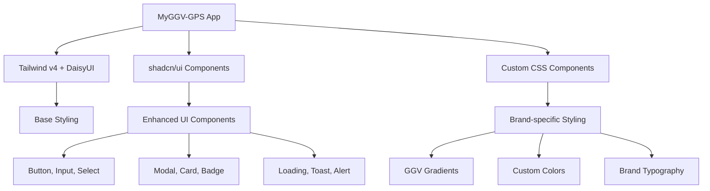

# 📋 Plan d'Installation shadcn/ui pour MyGGV-GPS

## 🎯 Objectifs
1. **Intégration harmonieuse** avec le design existant (gradients verts/jaunes, style GGV)
2. **Compatibilité** avec Tailwind v4 + DaisyUI
3. **Amélioration progressive** des composants existants
4. **Maintien** de l'identité visuelle GGV

## 🏗️ Architecture Proposée



## 📦 Composants à Installer

### **Phase 1 : Fondations**
- ✅ `clsx` et `tailwind-merge` (dépendances manquantes)
- ✅ Configuration `components.json` adaptée
- ✅ Mise à jour de la fonction `cn()` dans `src/lib/utils.js`

### **Phase 2 : Composants de Base**
- 🔄 **Button** : Remplacer les boutons du `WelcomeModal`
- 🔄 **Input** : Améliorer les champs de saisie
- 🔄 **Select** : Moderniser le sélecteur de block
- 🔄 **Card** : Structure pour les modales

### **Phase 3 : Composants Avancés**
- 🆕 **Toast** : Notifications d'erreur élégantes
- 🆕 **Badge** : Indicateurs de statut
- 🆕 **Spinner** : Loading states cohérents

## 🎨 Stratégie de Design

### **Conservation de l'Identité GGV**
```css
/* Variables CSS existantes à préserver */
--color-green: #50aa61
--color-yellow: #f3c549
--color-white: #f4f4f4
--color-black: #121212
```

### **Intégration shadcn/ui**
- **Thème personnalisé** avec les couleurs GGV
- **Variants DaisyUI** compatibles
- **CSS Variables** pour cohérence

## 🔧 Configuration Technique

### **Tailwind v4 Compatibility**
- Configuration adaptée pour Tailwind v4
- Préservation du setup `@tailwindcss/vite`
- Intégration avec `DaisyUI`

### **Structure des Fichiers**
```
src/
├── components/
│   ├── ui/           # shadcn/ui components
│   │   ├── button.jsx
│   │   ├── input.jsx
│   │   ├── select.jsx
│   │   ├── card.jsx
│   │   ├── toast.jsx
│   │   └── badge.jsx
│   ├── WelcomeModal.jsx  # Existing (to enhance)
│   ├── Header.jsx        # Existing
│   └── Footer.jsx        # Existing
├── lib/
│   └── utils.js      # Enhanced cn() function
└── styles/
    └── globals.css   # shadcn/ui + GGV theme
```

## 📋 Étapes d'Installation

### **Étape 1 : Installation des Dépendances**
```bash
npm install clsx tailwind-merge
npm install class-variance-authority
npm install @radix-ui/react-slot
```

### **Étape 2 : Configuration components.json**
```json
{
  "$schema": "https://ui.shadcn.com/schema.json",
  "style": "default",
  "rsc": false,
  "tsx": false,
  "tailwind": {
    "config": "tailwind.config.js",
    "css": "src/index.css",
    "baseColor": "slate",
    "cssVariables": true,
    "prefix": ""
  },
  "aliases": {
    "components": "src/components",
    "utils": "src/lib/utils",
    "ui": "src/components/ui"
  }
}
```

### **Étape 3 : Mise à jour de src/lib/utils.js**
```javascript
import { clsx } from "clsx";
import { twMerge } from "tailwind-merge";

/**
 * Combine clsx et twMerge pour des classes Tailwind optimisées
 * @param {import("clsx").ClassValue[]} inputs
 * @returns {string}
 */
export function cn(...inputs) {
  return twMerge(clsx(inputs));
}
```

### **Étape 4 : Configuration du Thème GGV**
Ajout des variables CSS dans `src/index.css` :
```css
@layer base {
  :root {
    /* Couleurs GGV existantes */
    --color-white: #f4f4f4;
    --color-green: #50aa61;
    --color-yellow: #f3c549;
    --color-black: #121212;
    
    /* Variables shadcn/ui adaptées */
    --background: 244 244 244;
    --foreground: 18 18 18;
    --primary: 80 170 97;
    --primary-foreground: 244 244 244;
    --secondary: 243 197 73;
    --secondary-foreground: 18 18 18;
    --muted: 241 245 249;
    --muted-foreground: 100 116 139;
    --accent: 241 245 249;
    --accent-foreground: 15 23 42;
    --destructive: 239 68 68;
    --destructive-foreground: 248 250 252;
    --border: 226 232 240;
    --input: 226 232 240;
    --ring: 80 170 97;
    --radius: 0.5rem;
  }
}
```

### **Étape 5 : Installation des Composants**

#### **Button Component**
```javascript
// src/components/ui/button.jsx
import * as React from "react";
import { Slot } from "@radix-ui/react-slot";
import { cva } from "class-variance-authority";
import { cn } from "../../lib/utils";

const buttonVariants = cva(
  "inline-flex items-center justify-center whitespace-nowrap rounded-md text-sm font-medium transition-colors focus-visible:outline-none focus-visible:ring-1 focus-visible:ring-ring disabled:pointer-events-none disabled:opacity-50",
  {
    variants: {
      variant: {
        default: "bg-primary text-primary-foreground shadow hover:bg-primary/90",
        destructive: "bg-destructive text-destructive-foreground shadow-sm hover:bg-destructive/90",
        outline: "border border-input bg-background shadow-sm hover:bg-accent hover:text-accent-foreground",
        secondary: "bg-secondary text-secondary-foreground shadow-sm hover:bg-secondary/80",
        ghost: "hover:bg-accent hover:text-accent-foreground",
        link: "text-primary underline-offset-4 hover:underline",
        ggv: "bg-gradient-to-r from-[var(--color-green)] to-[var(--color-yellow)] text-white shadow-lg hover:shadow-xl transition-all duration-200",
      },
      size: {
        default: "h-9 px-4 py-2",
        sm: "h-8 rounded-md px-3 text-xs",
        lg: "h-10 rounded-md px-8",
        icon: "h-9 w-9",
      },
    },
    defaultVariants: {
      variant: "default",
      size: "default",
    },
  }
);

const Button = React.forwardRef(({ className, variant, size, asChild = false, ...props }, ref) => {
  const Comp = asChild ? Slot : "button";
  return (
    <Comp
      className={cn(buttonVariants({ variant, size, className }))}
      ref={ref}
      {...props}
    />
  );
});
Button.displayName = "Button";

export { Button, buttonVariants };
```

## 🎯 Bénéfices Attendus

- **Cohérence visuelle** améliorée
- **Accessibilité** renforcée (ARIA, keyboard navigation)
- **Maintenabilité** du code
- **Performance** optimisée
- **Expérience utilisateur** moderne

## 🚀 Composants Prioritaires

Basé sur l'analyse du `WelcomeModal`, ordre de priorité :

1. **Button** → Remplacer `.modal-button`
2. **Select** → Améliorer le sélecteur de block
3. **Input** → Moderniser le champ lot number
4. **Card** → Structure de la modale
5. **Alert** → Gestion des erreurs

## 📝 Migration Progressive

### **WelcomeModal.jsx - Avant/Après**

**Avant :**
```javascript
<button
  type="submit"
  disabled={isLoading || !blockNumber || !lotNumber}
  className="modal-button primary"
>
  {isLoading ? (
    <>
      <div className="spinner"></div>
      Ok...
    </>
  ) : (
    <span className="span-mirror">🛵💨</span>
  )}
</button>
```

**Après :**
```javascript
<Button
  type="submit"
  disabled={isLoading || !blockNumber || !lotNumber}
  variant="ggv"
  size="lg"
>
  {isLoading ? (
    <>
      <Spinner className="mr-2" />
      Ok...
    </>
  ) : (
    <span className="span-mirror">🛵💨</span>
  )}
</Button>
```

## ✅ Checklist d'Installation

- [ ] Installation des dépendances npm
- [ ] Création du fichier `components.json`
- [ ] Mise à jour de `src/lib/utils.js`
- [ ] Configuration du thème GGV dans `src/index.css`
- [ ] Création des composants UI de base
- [ ] Migration du `WelcomeModal`
- [ ] Tests de compatibilité avec DaisyUI
- [ ] Validation de l'identité visuelle GGV

## 🔄 Prochaines Étapes

1. **Implémentation** des composants de base
2. **Migration** progressive des composants existants
3. **Tests** de compatibilité et performance
4. **Documentation** des nouveaux composants
5. **Optimisation** finale

---

**Status :** Prêt pour l'implémentation
**Mode suivant :** Code (pour l'installation technique)