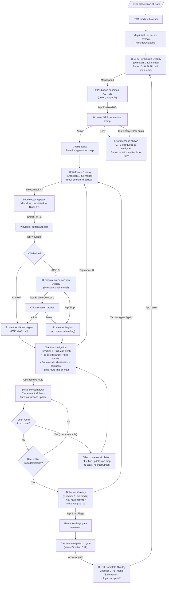
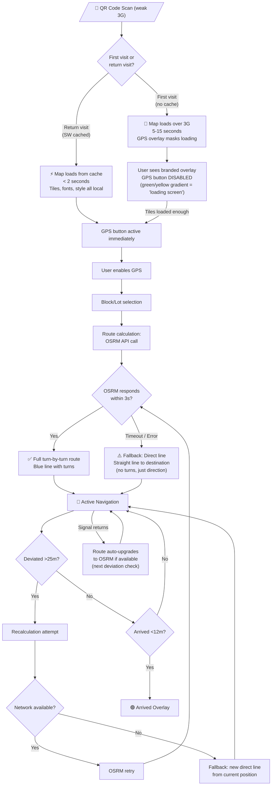
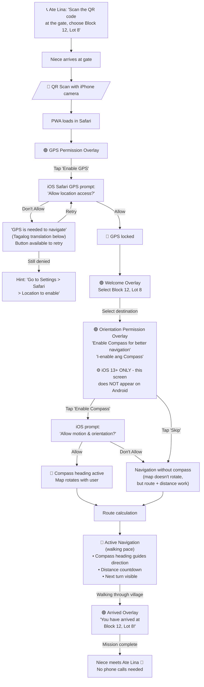

# UX Design Specification - MyGGV GPS

**Author:** Charles
**Date:** 2026-02-19

---

## Executive Summary

### Project Vision

MyGGV GPS is the sole navigation system for Garden Grove Village — a residential community in the Philippines with ~50 blocks and ~2,500 lots where Google Maps and Waze fail completely. Accessed via QR code scan at the village entrance, the app delivers zero-install, zero-signup turn-by-turn navigation to any lot in the village.

The UX challenge is singular: make the path from QR scan to active navigation as fast and frictionless as possible, on low-end Android smartphones with weak 3G connections. Every design decision must serve this goal.

### Target Users

**Primary: Delivery Riders (Marco persona) — ~80% of traffic**

- Device: Budget Android smartphones (Vivo, Samsung A-series), Globe/Smart 3G
- Context: Standing at village gate, package in hand, time-pressured (3+ deliveries remaining)
- Behavior: Scans QR code, selects block/lot, follows navigation, delivers, exits
- Tolerance for friction: Near zero. If the map doesn't load fast, they'll ask a guard for directions
- Tech literacy: Moderate — comfortable with phone basics, but won't troubleshoot issues

**Secondary: Family Visitors (Ate Lina's Niece persona)**

- Device: Mix of Android and iPhone, variable connectivity
- Context: First-time visitor guided by a resident's verbal instructions ("scan the QR code at the gate")
- Behavior: More patient than riders, but equally unfamiliar with the village layout
- Special needs: iOS permission flows (GPS + DeviceOrientation) require extra UX guidance

**Tertiary: Residents**

- Use case: Share the app with visitors, may install PWA for personal navigation
- Low priority for UX design — they know the village

**Admin: Charles (project owner)**

- Manages block/lot data via Supabase dashboard
- Future: Analytics dashboard for usage monitoring
- Not a primary UX consideration for the navigation app itself

### Key Design Challenges

1. **The Loading Wall on 3G** — The #1 UX problem. A delivery rider at the gate has near-zero patience. The map currently takes 10-15+ seconds on first visit over 3G. The target is < 5s first visit, < 2s cached. UX must minimize perceived wait time through progressive loading, skeleton states, and potentially pre-bundled village tiles to eliminate network dependency for the core map.

2. **Mandatory Permission Gates** — GPS and device orientation permissions are non-negotiable for navigation. Each permission screen is a friction barrier between the user and their destination. The UX must make these steps feel fast, purposeful, and trustworthy — clear one-line explanations, prominent action buttons, and instant transitions upon granting.

3. **Extreme Usage Context** — Users navigate on smartphones held in one hand, potentially in direct sunlight, standing beside a motorcycle. The UI must be readable in bright outdoor light (high contrast), touch targets must be generous (minimum 44x44px), and critical navigation data (distance, direction, next turn) must be visible at a glance without scrolling.

### Design Opportunities

1. **Zero-Friction "Scan-and-Go" Magic Moment** — The QR code entry eliminates all installation friction. The UX can amplify this advantage by making the time between scan and active navigation feel almost instantaneous — this is the product's signature experience and competitive moat against any future competitor.

2. **Radical Simplicity as Feature** — With only 6 screens in a strictly linear flow, MyGGV GPS can be simpler than any mainstream navigation app. No menus, no settings, no accounts, no search bar — just "Where are you going?" This simplicity is a deliberate UX advantage for users who need to navigate under time pressure on unfamiliar devices.

3. **Perceived Performance Through UX** — Progressive map loading, skeleton UI states, smooth Framer Motion transitions between navigation states, and immediate visual feedback on every interaction can make the app feel fast even before technical optimizations are complete.

## Core User Experience

### Defining Experience

The core experience of MyGGV GPS is a strictly linear, 6-step guided flow from QR scan to arrival. The defining interaction is NOT a single action — it's the feeling of being guided through an unfamiliar village without ever needing to think, ask, or hesitate.

**The Core Loop:**
QR scan → Map loads → Enable GPS → Select block/lot → Follow navigation → Arrive

Every step gates the next. The map must load before GPS can be enabled. GPS must lock before destination selection makes sense. The route must calculate before navigation begins. This serial dependency chain means the first step — map loading — is the single most critical UX moment. If it fails or takes too long, the entire experience collapses before it begins.

**The Core Action:** Getting from "I just scanned this QR code" to "I can see where I'm going" in the fewest seconds possible.

### Platform Strategy

**Platform:** Mobile-first Progressive Web App (PWA) — no native app, no install

- Primary: Chrome on Android (budget smartphones, 3G)
- Secondary: Safari on iOS 13+ (requires explicit permission prompts)
- Not supported: Desktop browsers

**Input model:** Touch-only, one-handed operation
**Orientation:** Portrait locked
**Offline strategy:** Full offline navigation after first visit (cached map, tiles, fonts, styles)
**Device capabilities leveraged:** GPS (Geolocation API), compass heading (DeviceOrientation API), camera (QR code scan — handled by OS, not the app)

**Key platform constraint:** The "Enable GPS" button is intentionally disabled until the map is sufficiently loaded. This creates a direct UX coupling between map load performance and the user's ability to begin their journey. Reducing map load time directly reduces time-to-first-interaction.

### Effortless Interactions

**What must require zero thought:**

- Navigation itself — the blue route line, camera following, turn instructions should "just work" without any user input after destination selection
- Route recalculation on deviation — happens silently and automatically when user strays >25m from route
- Arrival detection — the app knows when you've arrived (<12m) without the user needing to confirm
- Camera tracking — map automatically follows user position and heading during navigation

**What must feel instant:**

- Map loading — the gateway to everything, must feel as fast as possible (skeleton states, progressive loading, pre-bundled tiles)
- Permission grants — tap "Enable GPS" and immediately transition to the next state, no visible delay
- Block/lot selection — tap block, tap lot, navigation begins
- State transitions — smooth Framer Motion animations between the 6 screens to mask any processing

**What the app handles automatically (no user action needed):**

- Route deviation detection and recalculation (every 5s check, >25m threshold)
- Camera bearing and pitch adjustments during navigation
- Fallback to direct line if OSRM routing fails
- Offline data serving when network is unavailable

### Critical Success Moments

1. **The Map Appears (make-or-break)** — The moment the map renders on screen after QR scan. This is the single most important UX moment. If users see a blank screen or spinner for more than a few seconds, they abandon. The "Enable GPS" button becoming active is the user's signal that "this is going to work." Every millisecond saved here directly increases user retention.

2. **Navigation Initializes (the magic moment)** — The moment the blue route line appears on the map and the camera smoothly repositions to follow the user. This is when the visitor thinks: "I'm being guided. I don't need to ask anyone for directions." This moment transforms the app from "a map" into "my personal guide through this village."

3. **Arrival Confirmation (the payoff)** — The app announces "You have arrived" and the user is standing at the right lot. The promise made at the QR code scan is fulfilled. For delivery riders, this means a successful delivery without wasted time. For visitors, this means finding Ate Lina's house without calling 5 times for directions.

4. **First-time user success** — Happens at moment #2 (navigation initializes). A user who has never seen this app, standing at the village gate, manages to get guided navigation working in under 30 seconds of interaction time. The linear flow (no choices except "which lot?") makes failure nearly impossible.

### Experience Principles

1. **Load Fast or Lose Them** — Map loading speed is the #1 UX priority. Every design decision must consider its impact on time-to-interactive. If a feature adds loading time, it must justify its existence. Pre-bundle, pre-cache, pre-load — do whatever it takes to get the map on screen fast.

2. **One Path, No Decisions** — The user flow is strictly linear: permission → selection → navigation → arrival. Never present choices that aren't essential. No menus, no settings, no "would you like to..." dialogs. The only real decision the user makes is "which block and lot?"

3. **The App Navigates, the User Follows** — After destination selection, the user should never need to interact with the app again. Navigation, recalculation, camera tracking, and arrival detection all happen automatically. The phone becomes a passive guide, not an interactive tool.

4. **Visible Progress, Never Blank** — The user must always see something meaningful on screen. During map loading: skeleton/progress indicator. During route calculation: visual feedback. During navigation: live distance, direction, next turn. A blank or frozen screen is the worst UX failure.

## Desired Emotional Response

### Primary Emotional Goals

MyGGV GPS is a utility tool, not an experience product. The emotional design goal is **invisible efficiency** — the app should feel like it barely exists between the user and their destination. No wow moments, no delight animations, no personality. Just fast, correct, done.

**Primary emotion: Confidence** — "This works. I know where I'm going."
**Secondary emotion: Calm** — "I don't need to think. I just follow."
**Tertiary emotion: Relief** — "I found it without asking anyone."

### Emotional Journey Mapping

| Stage               | Target Emotion                                                  | Design Implication                                              |
| ------------------- | --------------------------------------------------------------- | --------------------------------------------------------------- |
| QR scan → loading   | **Patience through trust** — "It's loading, I can see progress" | Visible loading progress, never a blank screen                  |
| Enable GPS          | **Effortless compliance** — "One tap, done"                     | Big clear button, one-line explanation, instant transition      |
| Block/lot selection | **Clarity and control** — "I see my destination, I tap it"      | Clean list, readable labels, no ambiguity                       |
| Route appears       | **Immediate confidence** — "I see the path, let's go"           | Route line appears fast, camera repositions smoothly            |
| Active navigation   | **Passive calm** — "I just follow the blue line"                | No decisions required, distance countdown visible               |
| Arrival             | **Quiet satisfaction** — "I'm here. Done."                      | Simple confirmation, clear next actions (navigate again / exit) |
| Error / deviation   | **Silent recovery** — "It recalculated, no big deal"            | No error modals, no alarms — just a new route line              |

### Micro-Emotions

**Critical micro-emotions to get right:**

- **Confidence over confusion** — At every screen, the user must know exactly what to do next. One action per screen, one big button, zero ambiguity.
- **Trust over skepticism** — The GPS permission screen must feel safe, not suspicious. Brief explanation of WHY ("to show your location on the map"), not just WHAT.
- **Calm over anxiety** — During navigation, the UI must feel stable. No flickering, no layout shifts, no unexpected popups. The map moves smoothly, the distance counts down steadily.
- **Acceptance over frustration** — When things go wrong (route fails, GPS drifts), the app handles it silently. The user should barely notice. No error dialogs, no "something went wrong" messages — just quiet recovery.

**Emotions to actively avoid:**

- Surprise (no unexpected behaviors, no cleverness)
- Delight (no animations for the sake of animation)
- Engagement (no prompts to rate, share, or interact beyond navigation)
- Personality (no branded voice, no mascot, no humor)

### Design Implications

| Emotional Goal  | UX Design Choice                                                                                                |
| --------------- | --------------------------------------------------------------------------------------------------------------- |
| Confidence      | Single action per screen, prominent CTA button, clear state indicators                                          |
| Calm            | Smooth camera transitions, stable layout, no layout shifts during navigation                                    |
| Efficiency      | Minimum tap count (GPS → block → lot → navigate = 4 taps to active navigation)                                  |
| Trust           | One-line permission explanations in plain language + Tagalog translation                                        |
| Silent recovery | Route recalculation with no modal/toast — route line simply updates on map                                      |
| Invisible app   | During active navigation, UI chrome is minimal — map dominates, only essential data shown (distance, next turn) |

### Emotional Design Principles

1. **Invisible is Better Than Beautiful** — The best utility UX is one the user doesn't notice. If they're thinking about the interface, something is wrong. The app should disappear behind the task.

2. **Silence Over Alerts** — Never interrupt the user with modals, toasts, or notifications during navigation. Errors are handled silently. Route recalculations just happen. The only interruption is arrival confirmation — because that's the goal.

3. **Steady, Not Flashy** — Animations serve function (smooth camera transitions, state changes), never decoration. Transitions should feel like the app is flowing forward, not performing.

4. **Trust Through Predictability** — Every screen does exactly one thing. Every button does exactly what it says. The user builds trust by never being surprised. Predictability IS the emotional design.

## UX Pattern Analysis & Inspiration

### Inspiring Products Analysis

**Grab / Lalamove (delivery & ride-hailing)**

- Core UX strength: Extremely linear task flow — open app → set destination → confirm → track. Zero branching decisions.
- Map integration: Full-screen map as primary UI, with overlay cards at the bottom for actions and info. The map IS the interface.
- Loading strategy: Map loads immediately from cache on repeat visits. Skeleton UI during data fetch.
- Relevant lesson: The "bottom card over full-screen map" pattern is the gold standard for mobile navigation apps in Southeast Asia. Users already understand it.

**FoodPanda (food delivery)**

- Core UX strength: Big, bold CTAs with high-contrast colors. Every screen has one obvious action. Touch targets are oversized for one-handed use.
- Selection flow: Category → item → confirm mirrors MyGGV's block → lot → navigate flow.
- Relevant lesson: Selection lists with large tap targets, clear labels, and minimal visual noise. Users scan, tap, done.

**GCash (mobile wallet)**

- Core UX strength: Works on extremely low-end devices and slow connections. Optimized for the Philippines market specifically — small bundle, aggressive caching, works on 3G.
- Permission handling: Simple one-screen permission requests with clear Tagalog explanations.
- Relevant lesson: Performance-first design for the Philippine mobile market. If GCash can process payments on 3G budget phones, MyGGV GPS can load a map.

**Common UX DNA across all four apps:**

- Full-screen primary content (map, list, dashboard) with floating action overlays
- One primary action per screen, oversized CTA buttons
- Minimal text, heavy use of icons and visual hierarchy
- Designed for one-handed portrait use on 5-6" screens
- Tagalog/English bilingual support as standard

### Transferable UX Patterns

**Navigation Pattern: Bottom Card Over Map**

- Full-screen map as canvas, UI controls in a bottom sheet/card overlay
- Already the pattern in MyGGV GPS — validate and refine it
- Applies to: GPS permission screen, navigation overlay, arrival overlay

**Selection Pattern: Two-Step Drill-Down**

- Grab: "Where to?" → pick from list. FoodPanda: Category → Item.
- MyGGV GPS: Block → Lot. Same mental model, users already trained.
- Keep it: Simple scrollable list, large touch targets, no search bar needed for ~50 blocks

**Feedback Pattern: Progress Without Numbers**

- Grab shows a moving car on a route line — users understand progress visually without reading
- MyGGV GPS: The blue route line with user dot moving along it IS the progress indicator
- During navigation, the shrinking route line is more intuitive than a distance number alone

**Loading Pattern: Skeleton + Progressive Reveal**

- GCash and Grab show skeleton layouts instantly, then populate with real data
- MyGGV GPS: Show map container with loading indicator immediately, then render tiles progressively
- The "Enable GPS" button being disabled during load already communicates "almost ready"

**Permission Pattern: Single-Purpose Screens**

- All four apps use dedicated full-screen permission requests with icon + one-line explanation + big button
- MyGGV GPS already follows this pattern — keep it, ensure Tagalog translation is present

### Anti-Patterns to Avoid

1. **The Splash Screen Trap** — Do NOT add a branded splash screen or loading animation before the map. Every second of splash screen is a second the user isn't seeing their map load. Go straight to the map container with a loading state.

2. **The Tutorial Overlay** — Do NOT add onboarding slides, tips, or "how to use" tutorials. The flow is simple enough that users should understand it from the UI alone. Tutorials add friction and are universally skipped.

3. **The Notification Permission Ask** — Do NOT request push notification permission. There is no use case for notifications in a scan-and-go navigation tool. Every unnecessary permission prompt erodes trust.

4. **The "Rate This App" Interrupt** — Do NOT add rating prompts, feedback requests, or "share with friends" modals. The user is trying to find Lot 23. Respect their task.

5. **The Settings Menu** — Do NOT add a settings or preferences screen. There is nothing to configure. The map style is fixed (no more satellite toggle). The language is fixed (English + Tagalog). The routing is automatic. Zero settings = zero confusion.

6. **The Complex List UI** — Do NOT add search bars, filters, or alphabetical jump indices to the block/lot selection. With ~50 blocks, a simple scrollable list is faster than typing a search query on a budget phone keyboard.

### Design Inspiration Strategy

**Adopt directly:**

- Bottom card over full-screen map layout (Grab/Lalamove standard)
- Single-action-per-screen with oversized CTA (FoodPanda pattern)
- Bilingual English/Tagalog UI text (GCash convention)
- Skeleton loading states for map container (GCash/Grab pattern)

**Adapt for MyGGV GPS context:**

- Two-step selection (block → lot) should be even simpler than Grab's destination picker — no search, no recent history, no favorites. Just a clean list.
- Navigation overlay should show less information than Grab/Waze — only distance remaining and next turn. No ETA (irrelevant for 2-minute village navigation), no speed, no traffic.

**Avoid entirely:**

- Splash screens, tutorials, onboarding flows
- Any permission beyond GPS and orientation
- Settings, preferences, or configuration screens
- Rating prompts, share buttons, feedback forms
- Search functionality for block/lot selection
- Complex map controls (zoom buttons, compass, layer toggles)

## Design System Foundation

### Design System Choice

**Approach: Design Tokens + Native CSS — Zero Dependencies**

No component library, no CSS framework, no build-time CSS tooling. The design system is a set of CSS custom properties (design tokens) defined in a single `:root` block, consumed by inline styles and CSS files already in the project. This adds exactly 0 bytes to the JavaScript bundle.

### Rationale for Selection

1. **Performance alignment** — Every kilobyte matters on 3G budget phones. A CSS-only design system adds negligible weight (~1KB of token definitions) vs. MUI (+150KB), Chakra (+100KB), or even Tailwind (+30KB purged).
2. **Architecture alignment** — The project philosophy is KISS with 7 core files. A token-based system respects this by adding conventions, not code.
3. **Brownfield compatibility** — The app is already in production. CSS custom properties can be adopted incrementally without rewriting existing styles.
4. **Solo developer pragmatism** — No learning curve. CSS custom properties are native browser features supported by all target browsers (Chrome Android, Safari iOS 13+).

### Implementation Approach

**Token Definition — Single Source of Truth:**

```css
:root {
  /* Colors */
  --color-primary: #4285f4; /* Route line, primary actions */
  --color-primary-active: #1a6ef5; /* Button pressed state */
  --color-surface: #ffffff; /* Overlay backgrounds */
  --color-surface-dim: #f5f5f5; /* Secondary surfaces */
  --color-text: #1a1a1a; /* Primary text */
  --color-text-secondary: #666666; /* Tagalog translations, hints */
  --color-success: #34a853; /* Arrival confirmation */
  --color-error: #ea4335; /* GPS denied, critical errors */
  --color-overlay-bg: rgba(0, 0, 0, 0.5); /* Map overlay backdrop */

  /* Typography */
  --font-family:
    -apple-system, BlinkMacSystemFont, "Segoe UI", Roboto, sans-serif;
  --font-size-xs: 12px; /* Fine print */
  --font-size-sm: 14px; /* Tagalog subtitles */
  --font-size-base: 16px; /* Body text (also prevents iOS zoom) */
  --font-size-lg: 20px; /* Section headers */
  --font-size-xl: 24px; /* Screen titles */
  --font-size-2xl: 32px; /* Distance display during navigation */
  --font-weight-normal: 400;
  --font-weight-medium: 500;
  --font-weight-bold: 700;

  /* Spacing */
  --space-xs: 4px;
  --space-sm: 8px;
  --space-md: 16px;
  --space-lg: 24px;
  --space-xl: 32px;
  --space-2xl: 48px;

  /* Touch Targets */
  --touch-target-min: 44px; /* WCAG 2.1 Level A minimum */
  --touch-target-cta: 56px; /* Primary CTA buttons */

  /* Border Radius */
  --radius-sm: 4px;
  --radius-md: 8px;
  --radius-lg: 12px;
  --radius-full: 9999px; /* Pill buttons */
  --radius-overlay: 16px 16px 0 0; /* Bottom sheet top corners */

  /* Shadows */
  --shadow-overlay: 0 -2px 16px rgba(0, 0, 0, 0.15);
  --shadow-button: 0 2px 8px rgba(0, 0, 0, 0.1);

  /* Z-Index Scale */
  --z-map: 0;
  --z-overlay: 100;
  --z-modal: 200;
  --z-toast: 300;

  /* Transitions */
  --transition-fast: 150ms ease;
  --transition-normal: 250ms ease;
  --transition-slow: 400ms ease;
}
```

**Token Usage Convention:**

```css
/* All styles reference tokens, never raw values */
.cta-button {
  min-height: var(--touch-target-cta);
  font-size: var(--font-size-base);
  font-weight: var(--font-weight-bold);
  background: var(--color-primary);
  border-radius: var(--radius-full);
  padding: var(--space-md) var(--space-xl);
  transition: background var(--transition-fast);
}

.overlay-card {
  background: var(--color-surface);
  border-radius: var(--radius-overlay);
  box-shadow: var(--shadow-overlay);
  padding: var(--space-lg);
}

.tagalog-text {
  font-size: var(--font-size-sm);
  color: var(--color-text-secondary);
}
```

### Customization Strategy

**Incremental Adoption:**

- Phase 1: Define tokens in `:root`, start using in new/modified styles
- Phase 2: During architecture cleanup (PRD Phase 2), migrate existing inline styles to token references
- No big-bang rewrite — tokens are adopted as files are touched

**Dark Mode:** Not planned. The app is used outdoors in daylight. High contrast light theme only.

**Responsive:** Not needed. Portrait-locked mobile PWA on 5-6" screens. Single breakpoint design.

**Token Governance:**

- Tokens are defined once in a single CSS file (or `:root` block in `app.css`)
- All overlays and components reference tokens, never hardcoded values
- New tokens are added only when an existing token doesn't cover the use case
- Token names are semantic (describe purpose, not value): `--color-primary` not `--color-blue`

## Defining Core Experience

### Defining Experience

**"Scan, tap, follow."**

The defining experience of MyGGV GPS in one sentence: "Scan the QR code at the gate, tap your block and lot, follow the blue line to your destination."

This is what Marco tells the next Lalamove rider. This is what Ate Lina tells her niece on the phone. The entire product value fits in 3 verbs. If a user can't describe the app this simply after using it once, the UX has failed.

### User Mental Model

**How users solve the problem today (without the app):**

1. **Ask the guard at the gate** — "Where is Block 47, Lot 23?" The guard gives verbal directions ("straight, second left, then right after the basketball court"). Unreliable — the guard doesn't know all 2,500 lots.
2. **Call the resident** — "I'm at the gate, how do I get to your house?" The resident gives phone directions in real-time ("keep going... no, turn LEFT... where are you now?"). Works but wastes both people's time.
3. **Wander and ask neighbors** — Walk/ride through the village asking people. Slow, embarrassing for delivery riders who are on the clock.
4. **Google Maps / Waze** — Attempt mainstream navigation. Fails completely — streets aren't referenced, lots don't exist on the map, routes go to the wrong location or dead-end.

**The mental model users bring to MyGGV GPS:**

Users already understand mobile navigation from Grab, Waze, and Google Maps. They expect:

- A map with a blue dot (me) and a destination pin
- A blue line showing the route
- The map following them as they move
- An announcement when they arrive

MyGGV GPS must match this mental model exactly. Zero learning curve. The only difference from Grab/Waze: the destination is selected from a block/lot list instead of a search bar — because block and lot numbers are how addresses work inside the village.

### Success Criteria

**The core experience succeeds when:**

| Criteria                                                           | Measurement                                                         |
| ------------------------------------------------------------------ | ------------------------------------------------------------------- |
| User reaches active navigation in < 30 seconds of interaction time | From first tap (Enable GPS) to route displayed on map               |
| Total taps to navigation: 4 or fewer                               | Enable GPS → Select block → Select lot → (auto-navigates)           |
| Zero wrong destinations                                            | User always arrives at the correct lot — never a neighbor's lot     |
| Zero "what do I do now?" moments                                   | At every screen, the next action is immediately obvious             |
| First-time success rate: near 100%                                 | A user who has never seen the app completes navigation without help |
| Return users skip to destination selection in < 5 seconds          | GPS already granted, map cached, straight to block selection        |

**The core experience fails when:**

- The user asks the guard for directions despite having the app open
- The user calls the resident while the app is calculating
- The user closes the browser because the map won't load
- The user arrives at the wrong lot
- The user doesn't understand what to tap next

### Novel UX Patterns

**Pattern analysis: 100% established patterns, zero novel interactions.**

MyGGV GPS does not need to teach users anything new. Every interaction uses patterns users already know from Grab, Waze, and Google Maps:

| Interaction           | Pattern Source          | MyGGV GPS Implementation                                   |
| --------------------- | ----------------------- | ---------------------------------------------------------- |
| Permission request    | Every app that uses GPS | Full-screen overlay with icon + explanation + big button   |
| Destination selection | Grab "Where to?" list   | Two-step drill-down: block list → lot list                 |
| Route display         | Google Maps / Waze      | Blue line on map from current position to destination      |
| Active navigation     | Google Maps / Waze      | Camera follows user, distance counts down, next turn shown |
| Arrival               | Grab "You have arrived" | Overlay confirmation with next action options              |

**The unique twist is not in interaction design — it's in data.** The app's value comes from hyper-local cadastral data (blocks + lots) that no other app has. The UX's job is to make that data accessible through patterns users already understand, not to invent new ways to interact.

**Innovation budget: zero.** Every ounce of effort goes into speed and reliability, not novel interactions.

### Experience Mechanics

**Step-by-step mechanics of the defining experience:**

**1. Initiation: QR Scan → App Loads**

- Trigger: User scans QR code at village gate with phone camera
- System: Browser opens PWA URL. Map container renders immediately with loading indicator.
- Background: MapLibre initializes, tiles load (from cache if repeat visit, from network if first visit)
- User sees: Map area with progress feedback. "Enable GPS" button is disabled until map is ready.
- Duration target: < 5s to interactive map (first visit, 3G), < 2s (cached)

**2. Permission: Enable GPS**

- Trigger: Map is loaded → "Enable GPS" button becomes active
- User action: Single tap on "Enable GPS" button
- System: Browser GPS permission prompt appears
- User action: Tap "Allow" on browser prompt
- System: GPS locks, blue dot appears on map, camera centers on user
- Transition: Automatic — app moves to destination selection (welcome screen)
- Duration target: < 3s from tap to GPS lock

**3. Interaction: Select Destination**

- Trigger: Welcome screen appears with block list
- User action: Tap a block number (e.g., "Block 47")
- System: Lot list for selected block appears
- User action: Tap a lot number (e.g., "Lot 23")
- System: Destination marker appears on map. Route calculation begins immediately.
- Transition: Orientation permission screen (if iOS and first time) or direct to navigation
- Duration target: < 2 taps, < 5s total selection time

**4. Permission (conditional): Device Orientation**

- Trigger: iOS 13+ devices only, first time only
- User action: Single tap on "Enable Compass" button
- System: iOS orientation permission prompt appears
- User action: Tap "Allow"
- Transition: Automatic to navigation screen
- Note: Android devices skip this step entirely

**5. Feedback: Active Navigation**

- Trigger: Route calculated, orientation granted (or Android)
- User sees: Full-screen map with blue route line, user dot, destination pin
- System provides: Camera auto-follows user position + heading. Distance remaining displayed. Next turn instruction shown.
- Deviation handling: If user strays >25m from route, new route calculates silently — blue line updates, no interruption.
- User action required: None. The user just follows the blue line.
- Duration: 1-5 minutes depending on distance within village

**6. Completion: Arrival**

- Trigger: User is within 12m of destination
- System: Arrival overlay appears — "You have arrived" / "Nakarating ka na"
- User sees: Confirmation with two clear options: "Navigate Again" (new destination) or "Exit Village" (route to gate)
- User action: Tap one of the two options, or close the app
- If "Exit Village": Navigation restarts with village gate as destination
- If "Navigate Again": Returns to block selection (step 3)

## Visual Design Foundation

### Color System

**Extracted from production CSS** (`src/styles/app.css`):

#### Brand Palette (Current Production)

| Token            | Value     | Usage                                                              |
| ---------------- | --------- | ------------------------------------------------------------------ |
| `--color-green`  | `#50aa61` | Primary brand, CTAs, active states, Tagalog text, compass, success |
| `--color-yellow` | `#f3c549` | Secondary brand, exit flow, accents, gradient partner              |
| `--color-white`  | `#f4f4f4` | Surface backgrounds, modal cards, button text on dark bg           |
| `--color-black`  | `#121212` | Primary text, headings, high-contrast elements                     |

#### Extended Colors (Used in CSS but not tokenized)

| Color            | Value                     | Context                                        |
| ---------------- | ------------------------- | ---------------------------------------------- |
| Green dark       | `#3d8a4d`                 | Gradient endpoint for primary buttons          |
| Green teal       | `#34d399`                 | Arrived overlay gradient, success accent       |
| Yellow dark      | `#d97706`                 | Exit overlay Tagalog text, exit button dark    |
| Yellow bright    | `#fbbf24`                 | Exit overlay gradient endpoint                 |
| Red error        | `#ef4444`                 | Cancel button, retry button, error border      |
| Red dark         | `#dc2626`                 | Error Tagalog text, retry hover                |
| Red darkest      | `#991b1b`                 | Error heading text                             |
| Error bg         | `#fef2f2`                 | Error message background                       |
| Gray text        | `#6b7280`                 | Error message body text                        |
| Gray light       | `#9ca3af`                 | Route source label (subtle)                    |
| Border subtle    | `rgba(18, 18, 18, 0.15)`  | Input borders, type selector borders           |
| Skip bg          | `rgba(18, 18, 18, 0.08)`  | Secondary/skip button backgrounds              |
| Overlay backdrop | `rgba(0, 0, 0, 0.7)`      | Full-screen overlay background                 |
| Green overlay    | `rgba(80, 170, 97, 0.75)` | GPS/welcome/orientation overlay gradient start |
| Yellow overlay   | `rgba(243, 197, 73, 0.7)` | GPS/welcome/orientation overlay gradient end   |

#### Semantic Color Mapping (Proposed Token Aliases)

```css
:root {
  /* Semantic aliases referencing existing brand tokens */
  --color-primary: var(--color-green); /* #50aa61 */
  --color-primary-dark: #3d8a4d; /* Button gradient endpoint */
  --color-secondary: var(--color-yellow); /* #f3c549 */
  --color-secondary-dark: #d97706; /* Exit flow accent */
  --color-surface: var(--color-white); /* #f4f4f4 */
  --color-text: var(--color-black); /* #121212 */
  --color-text-tagalog: var(--color-green); /* Tagalog translations */
  --color-text-muted: rgba(
    18,
    18,
    18,
    0.7
  ); /* Description text (black + opacity) */
  --color-success: #34d399; /* Arrival confirmation */
  --color-error: #ef4444; /* Errors, cancel actions */
  --color-error-dark: #dc2626; /* Error hover/accent */
  --color-overlay-bg: rgba(0, 0, 0, 0.7); /* Modal backdrop */
}
```

#### Gradient System (Heavily Used)

```css
/* Brand gradient — used on body background, icon wrappers, overlay backdrops */
background: linear-gradient(135deg, var(--color-green), var(--color-yellow));

/* Primary button gradient — all CTA buttons */
background: linear-gradient(135deg, var(--color-green) 0%, #3d8a4d 100%);

/* Exit flow gradient — yellow-themed for exit overlays */
background: linear-gradient(135deg, var(--color-yellow) 0%, #d97706 100%);

/* Overlay backdrop gradient — semi-transparent brand colors */
background: linear-gradient(
  135deg,
  rgba(80, 170, 97, 0.75) 0%,
  rgba(243, 197, 73, 0.7) 100%
);

/* Top accent bar — 5px gradient at top of every modal */
background: linear-gradient(90deg, var(--color-green), var(--color-yellow));
```

### Typography System

#### Font Family

- **Primary font**: "Madimi One" (cursive, sans-serif fallback)
- **Weight**: 400 only (single weight, display font)
- **Loading**: `font-display: swap` — text visible immediately with fallback, swap when loaded
- **Hosting**: Self-hosted woff2 (`/fonts/madimi-one-latin.woff2` + `madimi-one-latin-ext.woff2`)
- **Unicode ranges**: Latin + Latin Extended (covers English + Tagalog with diacritics)
- **Rendering**: `font-synthesis: none`, `-webkit-font-smoothing: antialiased`

#### Type Scale (Extracted from CSS)

| Role                  | Size              | Weight | Usage                              |
| --------------------- | ----------------- | ------ | ---------------------------------- |
| Screen title          | `1.5rem`          | 700    | Overlay headings (GPS, Welcome...) |
| Screen title (641px+) | `1.75rem`         | 700    | Desktop enhancement                |
| CTA button text       | `1.125rem`        | 700    | Primary action buttons             |
| Body/description      | `1.0625rem`       | 400    | Overlay description text           |
| Tagalog subtitle      | `1rem`            | 400    | Tagalog translations, italic       |
| Block selector label  | `0.875rem`        | 600    | Form labels, nav destination name  |
| Nav remaining dist    | `1.25rem`         | 700    | Distance display during navigation |
| Nav turn distance     | `0.75rem`         | 600    | Next turn distance, type buttons   |
| Version text          | `0.75rem`         | 400    | Fine print, version number         |
| Route source label    | `0.625rem`        | 400    | Uppercase, letter-spaced subtle    |
| Input (iOS zoom fix)  | `16px !important` | —      | All inputs to prevent iOS zoom     |

#### Text Styling Patterns

```css
/* Primary text: black with full opacity */
color: var(--color-black);

/* Description text: black with reduced opacity */
color: var(--color-black);
opacity: 0.7;
line-height: 1.6;

/* Tagalog text: green, italic, slight opacity */
color: var(--color-green);
font-style: italic;
opacity: 0.85-0.9;
text-shadow: 0 1px 2px rgba(0, 0, 0, 0.15);

/* Subtle label: gray, uppercase, letter-spaced */
color: #9ca3af;
text-transform: uppercase;
letter-spacing: 0.05em;
```

### Spacing & Layout Foundation

#### Modal / Overlay Spacing

| Element                     | Mobile        | Desktop (641px+) |
| --------------------------- | ------------- | ---------------- |
| Overlay padding             | `1rem`        | `1rem`           |
| Modal padding               | `2rem 1.5rem` | `2.5rem 2rem`    |
| Modal border-radius         | `1.5rem`      | `1.5rem`         |
| Section gap (margin-bottom) | `1-2rem`      | `1-2rem`         |
| Icon wrapper size           | `5rem`        | `6rem`           |
| Icon inner size             | `2.5rem`      | `3rem`           |
| Top accent bar height       | `5px`         | `5px`            |

#### Button Spacing

| Element           | Value                                                  |
| ----------------- | ------------------------------------------------------ |
| Primary CTA       | `padding: 1rem 1.5rem`, `border-radius: 1rem`          |
| Secondary button  | `padding: 0.875rem 1.5rem`, `border-radius: 0.75rem`   |
| Type selector     | `padding: 0.625rem 0.375rem`, `border-radius: 0.75rem` |
| Button gap (icon) | `0.75rem`                                              |
| Button shadow     | `0 4px 15px rgba(80, 170, 97, 0.4)`                    |
| Button hover      | `translateY(-3px)`, shadow intensifies                 |
| Button active     | `translateY(-1px)`                                     |

#### Viewport Handling

```css
/* Triple fallback for mobile viewport height */
height: 100dvh; /* Dynamic viewport (priority) */
height: 100svh; /* Small viewport fallback */
min-height: -webkit-fill-available; /* iOS Safari fallback */
```

#### Z-Index Scale (Extracted)

| Layer          | Z-Index | Usage                        |
| -------------- | ------- | ---------------------------- |
| Map            | `0`     | Map container (base layer)   |
| Map controls   | `100`   | Zoom/pitch buttons           |
| GGV Logo       | `800`   | Top center logo              |
| Navigation bar | `900`   | Nav overlay (top bar)        |
| Full overlays  | `1000`  | GPS, Welcome, Arrived modals |

### Accessibility Considerations

#### Touch Targets

| Element               | Current Size                              | WCAG Minimum | Status     |
| --------------------- | ----------------------------------------- | ------------ | ---------- |
| Primary CTA buttons   | Full width, `1rem` padding (height ~50px) | 44x44px      | Pass       |
| Map control buttons   | `3rem` (48px)                             | 44x44px      | Pass       |
| Type selector buttons | Full flex, ~45px height                   | 44x44px      | Pass       |
| Compass ring          | `3.5rem` (56px)                           | 44x44px      | Pass       |
| Nav cancel button     | `2rem` (32px)                             | 44x44px      | **Fail**   |
| Select dropdown       | Full width, `0.875rem` padding (~44px)    | 44x44px      | Borderline |

**Action needed**: The navigation cancel button at `2rem` (32px) is below the 44px WCAG minimum. Recommend increasing to `2.75rem` (44px) minimum.

#### Contrast Ratios

| Combination                           | Ratio  | WCAG AA (4.5:1)  | Status         |
| ------------------------------------- | ------ | ---------------- | -------------- |
| `#121212` on `#f4f4f4` (text/surface) | ~16:1  | 4.5:1            | Pass           |
| `#f4f4f4` on `#50aa61` (btn text)     | ~3.2:1 | 3:1 (large text) | Pass (large)   |
| `#50aa61` on `#f4f4f4` (Tagalog)      | ~3.2:1 | 4.5:1            | **Borderline** |
| `#ef4444` on `#f4f4f4` (error/cancel) | ~3.7:1 | 3:1 (large text) | Pass (large)   |

**Note**: Green Tagalog text (`#50aa61`) on light surface (`#f4f4f4`) has a contrast ratio of ~3.2:1, which passes for large text (3:1) but fails for normal text (4.5:1 required). Since Tagalog text is typically secondary and shown at `1rem` size, consider either darkening the green for text use (`#3d8a4d` would improve to ~4.8:1) or increasing the Tagalog text size.

#### Animation & Motion

- All functional animations use `ease` or `ease-out` timing — no jarring linear movements
- `gps-pulse` animation is subtle (scale 1 to 1.08) — safe for motion-sensitive users
- `success-bounce` on arrival icon is brief (0.6s) — acceptable
- Compass transition is fast (`0.15s ease-out`) — feels responsive without being distracting
- **Recommendation**: Add `prefers-reduced-motion` media query to disable decorative animations (pulse, compass-spin) for users who request reduced motion

## Design Direction Decision

### Design Directions Explored

Six visual approaches were evaluated through an interactive HTML showcase (`ux-design-directions.html`), each showing the GPS Permission and Active Navigation screens:

1. **Current Refined** — Existing centered modal overlay with green/yellow gradient backdrop
2. **Bottom Sheet** — Grab/Lalamove-style bottom sheet, map always visible above
3. **Full Map First** — Maximum map real estate, floating glass-morphism pills
4. **Card Stack** — Progress-aware stacked cards with step indicators
5. **Bold Mono** — Dark overlay, giant typography, industrial minimalism
6. **Split Screen** — Fixed 50/50 split between map and interaction zone

### Chosen Direction

**Hybrid approach: Direction 1 (Current Refined) for permission/gate screens + Direction 3 (Full Map First) for active navigation.**

This hybrid leverages the strengths of each direction at the moment they matter most:

| Screen State                    | Direction           | Rationale                                                                                                                                                                                      |
| ------------------------------- | ------------------- | ---------------------------------------------------------------------------------------------------------------------------------------------------------------------------------------------- |
| GPS Permission                  | 1 - Current Refined | Full overlay masks slow map loading on 3G. The gradient backdrop serves as a branded "welcome screen" while tiles load behind it. Users on slow connections never see an ugly half-loaded map. |
| Welcome (destination selection) | 1 - Current Refined | Same full overlay pattern — consistent with GPS permission, map continues loading/caching in background.                                                                                       |
| Orientation Permission          | 1 - Current Refined | Brief permission step, same modal pattern for consistency.                                                                                                                                     |
| Active Navigation               | 3 - Full Map First  | Once the map is loaded, maximize map visibility. Floating pill at top (distance + next turn + cancel), floating strip at bottom (destination + compass). Map dominates the screen.             |
| Arrived                         | 1 - Current Refined | Full overlay for arrival confirmation — clear "mission complete" moment with action buttons.                                                                                                   |
| Exit Complete                   | 1 - Current Refined | Full overlay for exit flow confirmation.                                                                                                                                                       |

### Design Rationale

1. **The loading problem drives the permission screen choice.** On 3G budget phones, the map takes 5-15 seconds to load. A full-screen branded overlay (green/yellow gradient + icon + CTA) provides a polished first impression while tiles download in the background. Without it, users would see a blank or partially rendered map — which reads as "broken."

2. **The navigation problem drives the map screen choice.** Once a delivery rider is actively navigating, every pixel of map visibility matters. The current top-bar navigation overlay (Direction 1) blocks the top 15% of the screen. Direction 3's floating pills reduce this to ~8% while showing the same information (distance, next turn, cancel button). The bottom strip adds compass and destination info without overlapping the route line.

3. **The transition is natural.** Permission screens are "gates" — the user must act before proceeding. Full overlays are appropriate for gates. Navigation is "passive following" — the user just watches the map. Minimal overlays are appropriate for passive states.

4. **Migration cost is manageable.** Permission/arrival overlays stay exactly as-is (zero changes). Only the navigation overlay needs refactoring from a fixed top bar to floating pills — a scoped CSS change that doesn't touch hook logic.

### Implementation Approach

**Phase 1 — Keep all permission/arrival overlays unchanged (Direction 1):**

- GPS Permission Overlay: No changes
- Welcome Overlay: No changes
- Orientation Permission Overlay: No changes
- Arrived Overlay: No changes
- Exit Complete Overlay: No changes

**Phase 2 — Refactor Navigation Overlay to floating pills (Direction 3):**

- Replace `.navigation-overlay` fixed top bar with two floating elements:
  - **Top pill**: `position: fixed; top; border-radius; backdrop-filter` — contains turn icon, distance, cancel button
  - **Bottom strip**: `position: fixed; bottom; border-radius; backdrop-filter` — contains destination name, turn instruction, compass
- Add `backdrop-filter: blur(10px)` with solid-color fallback for budget devices that don't support backdrop-filter
- Ensure floating elements don't overlap MapLibre controls (GeolocateControl, attribution)
- Test on budget Android devices for backdrop-filter performance

**Accessibility fix to include:**

- Increase navigation cancel button from `2rem` (32px) to `2.75rem` (44px) per WCAG touch target minimum

## User Journey Flows

### Journey 1: Primary Navigation Flow (Marco Happy Path + Village Exit)

**Persona:** Marco, Lalamove delivery rider, budget Android, 3G
**Trigger:** QR code scan at village gate
**Goal:** Navigate to Block 47, Lot 23 → deliver → exit village



**Key metrics:**

- Taps to active navigation: **4** (Enable GPS → Select Block → Select Lot → Navigate)
- Interaction time target: **< 30 seconds** from first tap to route on map
- Total screens: **6** (matching the state machine)
- User decisions: **2** (which block, which lot — everything else is automatic)

### Journey 2: Error Recovery Flow (Marco Slow Network)

**Persona:** Marco, same rider, but 1-bar 3G signal
**Trigger:** Same QR scan, degraded connectivity
**Goal:** Navigate despite network issues



**Error recovery principles:**

- **Never show error dialogs** — fallback silently to the next option
- **Cascading fallback**: OSRM (full route) → Direct line (direction only)
- **Auto-upgrade**: When signal returns, next recalculation uses OSRM
- **Cached assets**: Return visitors get near-instant load regardless of network
- **The GPS overlay IS the loading screen**: Users never see a broken map state

### Journey 3: iOS Visitor Flow (Ate Lina's Niece)

**Persona:** Young woman, iPhone, first-time visitor, walking
**Trigger:** Resident told her to scan QR code
**Goal:** Walk to Block 12, Lot 8



**iOS-specific considerations:**

- **Two permission screens** instead of one (GPS + Orientation) — Android skips orientation
- **Safari-specific GPS prompt** — wording differs from Chrome
- **Compass is optional** — navigation works without it, just no map rotation
- **Settings hint** — if user denies GPS twice, suggest going to iOS Settings
- **Walking pace** — camera tracking is gentler than vehicle navigation

### Journey Patterns

**Pattern 1: Gate Screen Pattern**
Every permission/selection screen follows the same structure:

- Full-screen overlay (Direction 1) with branded gradient backdrop
- Centered modal card with: Icon → Title (EN) → Subtitle (Tagalog) → Description → Primary CTA
- Single action per screen — one big green button
- Map loads/renders behind the overlay (invisible to user)

**Pattern 2: Silent Fallback Pattern**
Every potential failure cascades to a degraded-but-functional state:

- OSRM timeout → Direct line
- Network offline → Cached assets
- Orientation denied → Navigation without compass
- GPS denied → Retry prompt with explanation
- No silent dead-ends — always a path forward

**Pattern 3: Auto-Recovery Pattern**
The app automatically upgrades when conditions improve:

- Signal returns → Next recalculation uses OSRM instead of direct line
- GPS accuracy improves → Camera tracking tightens
- No user action needed — the system self-heals

**Pattern 4: Minimal Chrome During Navigation**
Once active navigation begins (Direction 3):

- Map fills 100% of screen
- Only two floating elements (top pill + bottom strip)
- No user interaction needed until arrival
- Cancel button always accessible but unobtrusive

### Flow Optimization Principles

1. **4 taps to navigation** — Enable GPS → Block → Lot → Navigate. Cannot be reduced further (each tap is essential).

2. **Zero-decision navigation** — After destination selection, the user makes no more decisions. Route calculation, camera tracking, deviation detection, arrival detection all happen automatically.

3. **Graceful degradation over error states** — The app never shows "Something went wrong." It shows a working (if degraded) experience: direct line instead of route, no compass instead of compass error, cached map instead of loading spinner.

4. **The overlay IS the loading strategy** — The branded GPS permission overlay is not just a permission gate — it's a deliberate loading screen that masks map initialization. This turns a technical limitation (slow 3G tile loading) into a polished brand moment.

5. **Progressive capability unlock** — Each step unlocks the next:
   - Map loaded → GPS button active
   - GPS locked → Destination selection available
   - Destination selected → Route calculated
   - Route ready → Navigation begins
   - Arrival detected → Exit options appear

## Component Strategy

### Design System Components

**Approach: Design Tokens + Native CSS (Zero Dependencies)**

MyGGV GPS uses a CSS-only component system — no component library, no CSS framework, no utility classes. All components are built with native CSS custom properties defined in `app.css`. This is consistent with the KISS architecture philosophy (7 files, minimal dependencies).

**Foundation Elements from Tokens:**

| Token Category | CSS Variables                                                       | Used By                     |
| -------------- | ------------------------------------------------------------------- | --------------------------- |
| Colors         | `--color-green`, `--color-yellow`, `--color-white`, `--color-black` | All overlays, buttons, text |
| Typography     | `--font-primary` ("Madimi One")                                     | All text elements           |
| Shadows        | `--shadow-strong`, `--shadow-dialog`                                | Modal cards, buttons        |
| Transitions    | `--transition-normal` (0.2s ease)                                   | Hover states, state changes |
| Gradients      | `--gradient-green`, `--gradient-mixed`                              | Overlay backdrops, buttons  |

**Existing Component Inventory (from CSS):**

| Component                      | CSS Namespace     | Screens Used           | Changes Needed               |
| ------------------------------ | ----------------- | ---------------------- | ---------------------------- |
| GPS Permission Overlay         | `.gps-*`          | gps-permission         | None (Direction 1)           |
| Welcome Overlay                | `.welcome-*`      | welcome                | None (Direction 1)           |
| Orientation Permission Overlay | `.orientation-*`  | orientation-permission | None (Direction 1)           |
| Navigation Overlay             | `.navigation-*`   | navigating             | **Refactor** (→ Direction 3) |
| Arrived Overlay                | `.arrived-*`      | arrived                | None (Direction 1)           |
| Exit Complete Overlay          | `.exit-*`         | exit-complete          | None (Direction 1)           |
| Map Control Buttons            | `.map-controls-*` | navigating             | None                         |

**Shared Gate Screen Pattern:**

The 5 "gate" overlays (GPS, Welcome, Orientation, Arrived, Exit) share an identical structural pattern:

```
.{namespace}-overlay          → position: fixed; inset: 0; z-index: 1000
  .{namespace}-backdrop       → gradient background (green/yellow/mixed)
  .{namespace}-card           → white card, centered, border-radius, shadow
    .{namespace}-icon-wrapper → circular icon container
    .{namespace}-title        → h1, English
    .{namespace}-subtitle     → p.tagalog, Tagalog translation
    .{namespace}-description  → explanatory text
    .{namespace}-cta          → primary green button, full width
```

This pattern is already implemented consistently across all 5 gate screens. No abstraction needed — CSS namespacing provides isolation, and the shared structure is maintained by convention.

### Custom Components

Two new custom components are needed to implement the Direction 3 (Full Map First) navigation UI. These replace the current `.navigation-overlay` top bar.

#### 1. Navigation Top Pill (`.nav-top-pill`)

**Purpose:** Display turn-by-turn info and cancel button during active navigation, with minimal map obstruction.

**Replaces:** The current `.navigation-overlay` fixed top bar (~15% of screen height).

**Anatomy:**

```
┌─────────────────────────────────────┐
│  ↰ Turn Left   •  350m  •  ✕      │  ← frosted glass pill
└─────────────────────────────────────┘
```

**CSS Specification:**

```css
.nav-top-pill {
  position: fixed;
  top: calc(env(safe-area-inset-top, 0px) + 0.75rem);
  left: 1rem;
  right: 1rem;
  z-index: 900;

  display: flex;
  align-items: center;
  justify-content: space-between;
  padding: 0.625rem 1rem;
  gap: 0.75rem;

  background: rgba(255, 255, 255, 0.85);
  backdrop-filter: blur(10px);
  -webkit-backdrop-filter: blur(10px);
  border-radius: 1.5rem;
  box-shadow: 0 2px 12px rgba(0, 0, 0, 0.15);

  font-family: var(--font-primary);
  color: var(--color-black);
}

/* Fallback for devices without backdrop-filter support */
@supports not (backdrop-filter: blur(10px)) {
  .nav-top-pill {
    background: rgba(255, 255, 255, 0.95);
  }
}
```

**Content Slots:**

| Slot   | Content                 | Style                                                  |
| ------ | ----------------------- | ------------------------------------------------------ |
| Left   | Turn icon + instruction | `font-size: 0.875rem`, truncated                       |
| Center | Distance to next turn   | `font-weight: bold`, `font-size: 1rem`                 |
| Right  | Cancel button (✕)       | `min-width: 2.75rem`, `min-height: 2.75rem` (WCAG fix) |

**States:**

- **Default**: Semi-transparent white, visible
- **Recalculating**: Subtle pulse animation on distance text
- **No route (direct line)**: Turn icon hidden, shows "Head toward destination" instead

**Accessibility:**

- Cancel button: `aria-label="Cancel navigation"`, minimum 44x44px tap target
- Turn instruction: `aria-live="polite"` for screen readers on instruction changes
- Sufficient contrast: Dark text on white/frosted background passes WCAG AA

#### 2. Navigation Bottom Strip (`.nav-bottom-strip`)

**Purpose:** Display destination name and compass bearing at the bottom of the screen during active navigation.

**Anatomy:**

```
┌──────────────────────────────────────┐
│  📍 Block 47, Lot 23    🧭 NE 42°   │  ← frosted glass strip
└──────────────────────────────────────┘
```

**CSS Specification:**

```css
.nav-bottom-strip {
  position: fixed;
  bottom: calc(env(safe-area-inset-bottom, 0px) + 0.75rem);
  left: 1rem;
  right: 1rem;
  z-index: 900;

  display: flex;
  align-items: center;
  justify-content: space-between;
  padding: 0.75rem 1rem;

  background: rgba(255, 255, 255, 0.85);
  backdrop-filter: blur(10px);
  -webkit-backdrop-filter: blur(10px);
  border-radius: 1.5rem;
  box-shadow: 0 2px 12px rgba(0, 0, 0, 0.15);

  font-family: var(--font-primary);
  color: var(--color-black);
}

@supports not (backdrop-filter: blur(10px)) {
  .nav-bottom-strip {
    background: rgba(255, 255, 255, 0.95);
  }
}
```

**Content Slots:**

| Slot  | Content                     | Style                                          |
| ----- | --------------------------- | ---------------------------------------------- |
| Left  | Destination icon + name     | `font-size: 0.875rem`, truncated with ellipsis |
| Right | Compass direction + bearing | `font-size: 0.875rem`, `min-width: 4rem`       |

**States:**

- **Default**: Shows destination and compass
- **No compass (orientation denied)**: Right slot shows distance remaining instead of bearing
- **Arrived (transition)**: Brief green flash before Arrived Overlay appears

**Accessibility:**

- Destination: `aria-label="Navigating to [destination]"`
- Compass: `aria-live="off"` (changes too frequently for screen readers)

#### 3. Map Control Buttons (`.map-controls-*`) — No Changes

The existing map control buttons (zoom, pitch, style toggle) at `z-index: 100` remain unchanged. They sit below the navigation pills (`z-index: 900`) and don't overlap.

**Z-Index Coordination:**

| Element                            | Z-Index | Position                      |
| ---------------------------------- | ------- | ----------------------------- |
| Map canvas                         | `0`     | Base layer                    |
| Map controls (zoom, pitch)         | `100`   | Bottom-right cluster          |
| GGV Logo                           | `800`   | Top center                    |
| Nav Top Pill                       | `900`   | Top, inset 1rem               |
| Nav Bottom Strip                   | `900`   | Bottom, inset 1rem            |
| Gate overlays (GPS, Welcome, etc.) | `1000`  | Full screen, above everything |

### Component Implementation Strategy

**5 overlays unchanged, 1 refactored into 2 floating elements.**

| Component                      | Action                                   | Effort |
| ------------------------------ | ---------------------------------------- | ------ |
| GPS Permission Overlay         | Keep as-is                               | None   |
| Welcome Overlay                | Keep as-is                               | None   |
| Orientation Permission Overlay | Keep as-is                               | None   |
| Navigation Overlay             | **Replace** with Top Pill + Bottom Strip | Medium |
| Arrived Overlay                | Keep as-is                               | None   |
| Exit Complete Overlay          | Keep as-is                               | None   |

**Refactoring scope for Navigation Overlay:**

- **CSS**: Replace `.navigation-overlay` (~80 lines) with `.nav-top-pill` + `.nav-bottom-strip` (~60 lines)
- **JSX**: Replace single `<NavigationOverlay>` component with two inline elements in App.jsx
- **Hooks**: Zero changes — `useNavigation` returns the same data (bearing, nextTurn, distanceRemaining, hasArrived)
- **State machine**: Zero changes — `navState === 'navigating'` still controls visibility

### Implementation Roadmap

**Phase 1 — No changes (Gate screens are production-ready):**

- GPS Permission Overlay: Tested, working
- Welcome Overlay: Tested, working
- Orientation Permission Overlay: Tested, working
- Arrived Overlay: Tested, working
- Exit Complete Overlay: Tested, working

**Phase 2 — Navigation pill refactor:**

1. Create `.nav-top-pill` CSS class with backdrop-filter + fallback
2. Create `.nav-bottom-strip` CSS class with same glass-morphism pattern
3. Replace `<NavigationOverlay>` JSX with two floating `<div>` elements
4. Wire existing `useNavigation` return values into new elements
5. Fix cancel button size: `2rem` → `2.75rem` (44px WCAG minimum)
6. Test on budget Android (backdrop-filter performance)
7. Test safe-area-inset on iPhone (notch/dynamic island)

**Phase 3 — Polish:**

1. Add `prefers-reduced-motion` media query for pulse animation
2. Darken Tagalog green text (`#50aa61` → `#3d8a4d`) for WCAG AA normal text compliance
3. Fine-tune pill border-radius and padding on various screen sizes
4. Verify z-index stacking with MapLibre GeolocateControl blue dot

## UX Consistency Patterns

### Button Hierarchy

**Three-tier button system used across all screens:**

| Tier | Visual Style | Usage | CSS Pattern |
| --- | --- | --- | --- |
| **Primary CTA** | Green gradient, full width, bold white text, shadow | One per screen — the single action the user should take | `background: var(--gradient-green)`, `padding: 1rem 1.5rem`, `border-radius: 1rem` |
| **Secondary Action** | White/light background, outlined or subtle fill | Alternative action (e.g., "Skip", "Navigate Again") | `padding: 0.875rem 1.5rem`, `border-radius: 0.75rem` |
| **Destructive/Cancel** | Red text or icon, minimal chrome | Cancel navigation, dismiss | `color: #ef4444`, `min-size: 2.75rem` (44px WCAG) |

**Button Behavior Rules:**

- **One primary CTA per screen** — Users should never choose between two green buttons
- **Primary CTA at bottom** — Always the last element in the card, full width, easiest thumb reach
- **Disabled state**: Reduced opacity (`opacity: 0.5`), `pointer-events: none`, no visual change on touch
- **Active/pressed state**: `translateY(-1px)`, shadow reduces — gives tactile feedback on mobile
- **Hover state** (desktop only): `translateY(-3px)`, shadow intensifies — ignored on touch devices
- **Loading state on CTA**: Text changes to action verb ("Calculating..." / "Enabling..."), button stays green but disabled

**Pattern: GPS Button Progressive Enable**

The GPS CTA button follows a unique progressive pattern:

```
Map NOT loaded → Button DISABLED (dimmed, no interaction)
Map loaded     → Button ENABLED (full green, pulse animation starts)
Tap            → Button shows "Enabling..." (disabled, loading)
GPS granted    → Auto-transition to next screen
GPS denied     → Error message appears, button re-enables for retry
```

### Feedback Patterns

**Core principle: Silent success, gentle errors, no interruptions during navigation.**

| Feedback Type | Pattern | Example |
| --- | --- | --- |
| **Success** | Auto-transition to next screen (no toast, no confirmation) | GPS granted → Welcome screen appears |
| **Error (recoverable)** | Inline text below the CTA, red text, with retry option | "GPS is required to navigate" + button stays available |
| **Error (degraded)** | Silent fallback, no user notification | OSRM timeout → Direct line drawn silently |
| **Loading** | CTA button text changes, button disabled | "Navigate" → "Calculating..." |
| **Progress** | Real-time data update in floating pills | Distance countdown: "350m → 280m → 150m..." |
| **Arrival** | Full-screen overlay transition with success animation | Arrived Overlay with `success-bounce` animation |

**Navigation-specific feedback:**

| Event | User Sees | User Does NOT See |
| --- | --- | --- |
| Route calculated | Blue line appears on map | No "Route ready" toast |
| Deviation detected | Blue line updates to new route | No "Recalculating..." toast |
| OSRM fails | Straight line to destination | No "API error" message |
| Signal returns | Route upgrades to full OSRM route | No "Connection restored" toast |
| Approaching arrival | Distance countdown accelerates | No "Almost there!" notification |
| Arrived | Full-screen Arrived Overlay | Overlay appears once, not repeatedly |

**Error message format:**

```
[English error message]
([Tagalog translation])
```

Example:

```
Enable GPS to navigate
(I-enable ang GPS para mag-navigate)
```

### Loading & Empty States

**Loading Strategy: The overlay IS the loading screen.**

| State | What User Sees | What Happens Behind |
| --- | --- | --- |
| **App cold start** | GPS Permission Overlay (branded gradient + icon + CTA disabled) | Map tiles downloading, style loading, fonts loading |
| **Map ready** | GPS CTA button becomes active (green pulse) | `isMapReady` flag flips, GeolocateControl ready |
| **Route calculating** | "Navigate" button text → "Calculating..." | OSRM API call in progress (3s timeout) |
| **Route recalculating** | No visible change (blue line updates silently) | Background OSRM fetch on deviation >25m |
| **GPS acquiring** | Blue dot pulses on map | `watchPosition` updating coordinates |

**No spinner patterns used.** The app never shows a loading spinner:

- Cold start: Branded overlay masks loading
- Route calc: Button text change is sufficient
- Recalculation: Silent, no indicator needed
- Map tiles: Progressive rendering (tiles appear as they load)

**No empty states exist.** Every screen has content:

- GPS screen: Always shows the permission prompt
- Welcome screen: Block/Lot dropdowns are pre-populated
- Navigation: Map is always visible with at least a direct line
- Arrived: Success confirmation always shown

### Navigation Patterns (State Transitions)

**All transitions follow a predictable pattern:**

| From State | Trigger | To State | Transition Style |
| --- | --- | --- | --- |
| `gps-permission` | GPS granted | `welcome` | Overlay crossfade (Framer Motion) |
| `welcome` | "Navigate" tapped | `orientation-permission` (iOS) or `navigating` (Android) | Overlay crossfade |
| `orientation-permission` | Permission granted/skipped | `navigating` | Overlay fades out, map revealed |
| `navigating` | Arrival <12m detected | `arrived` | Map fades, overlay fades in |
| `arrived` | "Navigate Again" | `welcome` | Overlay crossfade |
| `arrived` | "Exit Village" | `navigating` (to gate) | Overlay fades out |
| `navigating` (to gate) | Arrival at gate | `exit-complete` | Overlay fades in |
| `exit-complete` | Auto-reset | `gps-permission` | Full reset |

**Transition animation specs:**

- **Gate → Gate** (overlay to overlay): Crossfade via Framer Motion `AnimatePresence`, duration `0.3s`
- **Gate → Navigation** (overlay disappearing): Fade out `0.3s`, map beneath already rendered
- **Navigation → Gate** (overlay appearing): Fade in `0.3s` over map
- **Back navigation**: Cancel (✕) in nav → return to `welcome` state, same fade transition

**No page transitions** — all transitions are overlay animations on top of the persistent map canvas. The map never unmounts or re-renders during state changes.

### Modal & Overlay Patterns

**Two distinct overlay paradigms:**

#### Paradigm 1: Gate Screen Overlays (Direction 1)

**Used for:** GPS Permission, Welcome, Orientation Permission, Arrived, Exit Complete

| Property | Value |
| --- | --- |
| Position | `fixed`, `inset: 0`, covers entire viewport |
| Z-index | `1000` (above everything) |
| Backdrop | Gradient (`--gradient-green`, `--gradient-mixed`, or `--gradient-yellow`) |
| Card | White, centered, `border-radius: 1.5rem`, `box-shadow: var(--shadow-dialog)` |
| Card max-width | `min(90vw, 400px)` |
| Dismissible | No — user must take action (CTA or skip) |
| Animation | Framer Motion `AnimatePresence` fade in/out |
| Scroll | Card is short enough to not need scrolling |

**Gate screen rules:**

- One CTA per screen (one green button)
- Icon at top, title, Tagalog subtitle, description, CTA at bottom
- No close (✕) button — forward-only flow
- Map continues rendering behind the overlay (invisible but loading)

#### Paradigm 2: Floating Navigation Elements (Direction 3)

**Used for:** Active Navigation only (`navState === 'navigating'`)

| Property | Value |
| --- | --- |
| Position | `fixed`, inset `0.75rem` from edges |
| Z-index | `900` (below gate overlays, above map controls) |
| Background | `rgba(255, 255, 255, 0.85)` with `backdrop-filter: blur(10px)` |
| Border-radius | `1.5rem` (pill shape) |
| Shadow | `0 2px 12px rgba(0, 0, 0, 0.15)` |
| Dismissible | Cancel (✕) returns to welcome screen |
| Content updates | Real-time (distance, bearing, turn instructions) |
| Safe area | Respects `env(safe-area-inset-top)` and `env(safe-area-inset-bottom)` |

**Floating element rules:**

- Maximum two floating elements (top pill + bottom strip)
- Never overlap MapLibre controls
- Never overlap each other
- Content truncates with ellipsis, never wraps to multiple lines
- Budget device fallback: solid white background instead of blur

### Selection Patterns

**Block/Lot selection uses native HTML `<select>` dropdowns:**

| Property | Value |
| --- | --- |
| Element | Native `<select>` (no custom dropdown library) |
| Font size | `1rem` (16px) — prevents iOS Safari auto-zoom |
| Padding | `0.875rem` — meets 44px touch target |
| Flow | Block dropdown → Lot dropdown appears → Navigate button appears |
| Population | Lots filtered by selected block (from `blocks.js` data) |
| Default | Placeholder text ("Select Block..." / "Select Lot...") |

**Why native `<select>`:** Budget Android devices render native dropdowns faster and more reliably than custom JavaScript dropdown components. The OS handles scroll momentum, touch targets, and accessibility automatically.

## Responsive Design & Accessibility

### Responsive Strategy

**Mobile-only by design.** MyGGV GPS is a navigation app accessed via QR code scan at a physical village gate. The target audience is delivery riders on motorbikes and walking visitors — 100% smartphone users. Desktop and tablet usage is incidental (admin/debugging only).

**Device Priority:**

| Priority | Device | Screen Width | Usage |
| --- | --- | --- | --- |
| **P0 (Primary)** | Budget Android phones | 360px - 412px | ~80% of traffic — Grab/Lalamove riders |
| **P1 (Secondary)** | iPhones (SE to Pro Max) | 375px - 430px | ~15% — visitors, residents |
| **P2 (Incidental)** | Tablets, Desktop | 768px+ | ~5% — admin, debugging, demo |

**Strategy per device tier:**

**P0 — Budget Android (360-412px):**

- All UI designed for this viewport first
- Gate screen cards: `min(90vw, 400px)` — fills most of the screen
- Navigation pills: `left: 1rem; right: 1rem` — edge-to-edge with 16px margins
- Native `<select>` dropdowns — OS-rendered, fast on low-end chipsets
- No backdrop-filter (solid fallback) — saves GPU on budget devices
- Touch targets: minimum 44x44px enforced

**P1 — iPhone (375-430px):**

- Same layout as P0 (screen sizes overlap)
- Safe area insets: `env(safe-area-inset-top)`, `env(safe-area-inset-bottom)` for notch/Dynamic Island
- iOS-specific orientation permission screen (extra gate screen)
- `font-size: 16px` on inputs — prevents Safari auto-zoom
- `-webkit-fill-available` viewport fallback

**P2 — Tablet/Desktop (768px+):**

- No responsive changes — app renders at mobile width
- Gate screen cards: capped at `400px` max-width, centered
- Map fills viewport — works fine at any size
- Navigation pills: capped width (no edge-to-edge stretching on wide screens)
- Not a priority for testing or optimization

### Breakpoint Strategy

**No CSS media query breakpoints needed.**

The app uses a single-layout approach:

```css
/* No media queries for layout changes */
/* Gate cards are responsive via min(90vw, 400px) */
/* Navigation pills use left/right: 1rem (fluid) */
/* Map container: width: 100%; height: 100dvh (always full) */
```

**Why no breakpoints:**

1. The app is a map-first navigation tool — the map fills 100% of the viewport at every size
2. Gate screen overlays are centered modal cards — they look correct at any width
3. Navigation floating pills are fluid (margin-based, not width-based)
4. There is no multi-column layout, no sidebar, no grid to rearrange
5. Adding breakpoints would add complexity with zero user benefit

**The only responsive technique used:** CSS `min()` for card max-width and viewport units (`dvh`, `svh`, `vw`) for full-screen sizing.

**Future consideration:** If a tablet/desktop admin view is added later, breakpoints would be needed only for that feature — not for the core navigation flow.

### Accessibility Strategy

**Target: WCAG 2.1 Level AA (practical compliance)**

Full AAA compliance is not pursued — the app's primary users are delivery riders in a time-sensitive context, and the visual design (brand colors, map-based UI) doesn't lend itself to AAA contrast ratios. AA compliance provides strong accessibility without compromising the navigation UX.

#### Color & Contrast

| Requirement | Status | Action |
| --- | --- | --- |
| Text on surface: 4.5:1 minimum | Pass — `#121212` on `#f4f4f4` = ~16:1 | None |
| Large text on color: 3:1 minimum | Pass — white on `#50aa61` = ~3.2:1 | None (buttons use large bold text) |
| Tagalog text (normal size): 4.5:1 | **Fail** — `#50aa61` on `#f4f4f4` = ~3.2:1 | Darken to `#3d8a4d` (~4.8:1) |
| Error text: 3:1 minimum | Pass — `#ef4444` on `#f4f4f4` = ~3.7:1 | None (used at large size) |
| Disabled state distinguishable | Pass — `opacity: 0.5` + `pointer-events: none` | None |

#### Touch Targets

| Element | Current | WCAG Minimum (44px) | Action |
| --- | --- | --- | --- |
| Primary CTA buttons | Full width, ~50px height | 44x44px | Pass |
| Map control buttons | 48px (3rem) | 44x44px | Pass |
| Type selector buttons | ~45px height | 44x44px | Pass |
| Compass ring | 56px (3.5rem) | 44x44px | Pass |
| Cancel button (nav) | **32px (2rem)** | 44x44px | **Fix → 2.75rem (44px)** |
| Select dropdown | ~44px height | 44x44px | Borderline — pass |

#### Screen Reader Support

**Minimal but functional.** The app is inherently visual (map-based navigation), which limits screen reader utility. However, basic support is provided:

| Element | ARIA Support |
| --- | --- |
| Gate screen CTAs | `aria-label` describing the action |
| Turn instructions (nav pill) | `aria-live="polite"` — announces instruction changes |
| Distance/bearing (nav strip) | `aria-live="off"` — changes too frequently |
| Map container | `role="application"`, `aria-label="Navigation map"` |
| Destination name | `aria-label="Navigating to [destination]"` |
| Cancel button | `aria-label="Cancel navigation"` |

**Limitation acknowledged:** A screen reader user cannot meaningfully use a GPS map navigation app. The ARIA attributes ensure that basic actions (enable GPS, select destination, cancel) are accessible, but turn-by-turn visual navigation requires sight.

#### Keyboard Navigation

**Not a priority.** The app is exclusively touch-based (mobile phones):

- No keyboard shortcuts implemented
- Tab order follows DOM order (naturally correct since overlays are sequential)
- Focus management: When gate overlay appears, focus moves to the primary CTA
- When navigation pill appears, focus is not trapped (user is watching the map, not interacting)

#### Motion & Animation

| Animation | Duration | Motion Sensitivity |
| --- | --- | --- |
| Overlay crossfade | 0.3s | Safe — no spatial movement |
| GPS pulse | Continuous, scale 1→1.08 | Subtle — safe |
| Success bounce | 0.6s, one-time | Brief — acceptable |
| Compass rotation | 0.15s ease-out | Functional, not decorative |
| Button hover lift | 0.2s translateY | Desktop only, subtle |

**`prefers-reduced-motion` implementation:**

```css
@media (prefers-reduced-motion: reduce) {
  /* Disable decorative animations */
  .gps-pulse { animation: none; }
  .compass-spin { transition: none; }
  .success-bounce { animation: none; }

  /* Keep functional transitions (shortened) */
  .nav-top-pill, .nav-bottom-strip {
    transition-duration: 0.01s;
  }
}
```

### Testing Strategy

**Priority-based testing matrix:**

#### P0 — Must Test (Every Change)

| Test | Device | Method |
| --- | --- | --- |
| GPS permission flow | Budget Android (Chrome) | Real device, 3G throttled |
| Route calculation + display | Budget Android (Chrome) | Real device |
| Navigation pills (top + bottom) | Budget Android (Chrome) | Real device, check backdrop-filter fallback |
| Touch targets (all buttons ≥ 44px) | Budget Android (Chrome) | DevTools + real device |
| Viewport height (no address bar gap) | Budget Android (Chrome) | Real device — scroll, rotate |

#### P1 — Must Test (Feature Changes)

| Test | Device | Method |
| --- | --- | --- |
| GPS + Orientation permissions | iPhone (Safari) | Real device |
| Safe area insets (notch) | iPhone (Safari) | Real device |
| Input zoom prevention | iPhone (Safari) | Real device — tap `<select>` |
| Contrast ratios | Any | Chrome DevTools Accessibility audit |
| Screen reader basics | iPhone (VoiceOver) | Real device — navigate gate screens |

#### P2 — Periodic (Monthly)

| Test | Device | Method |
| --- | --- | --- |
| Lighthouse accessibility score | Desktop Chrome | DevTools Lighthouse |
| Full WCAG AA audit | Any | axe DevTools extension |
| Tablet rendering | iPad / Android tablet | Real device or emulator |
| `prefers-reduced-motion` | Desktop Chrome | DevTools → Rendering → Emulate |

### Implementation Guidelines

**For developers implementing responsive and accessibility features:**

#### CSS Units

| Use | Don't Use | Why |
| --- | --- | --- |
| `rem` for spacing/sizing | `px` for layout | Respects user font-size preferences |
| `dvh` / `svh` for viewport | `vh` alone | Handles mobile address bar correctly |
| `min(90vw, 400px)` for cards | Fixed `width: 380px` | Fluid within bounds |
| `env(safe-area-inset-*)` | Hardcoded notch offsets | Cross-device safe area support |

#### Semantic HTML

```html
<!-- Gate screen structure -->
<section class="gps-overlay" role="dialog" aria-labelledby="gps-title">
  <div class="gps-card">
    <h1 id="gps-title">Enable Location</h1>
    <p class="tagalog">(I-enable ang Lokasyon)</p>
    <button class="gps-cta" aria-label="Enable GPS location">
      Enable GPS
    </button>
  </div>
</section>

<!-- Navigation pills -->
<nav class="nav-top-pill" aria-label="Navigation info">
  <span aria-live="polite">Turn left in 350m</span>
  <button aria-label="Cancel navigation" class="nav-cancel">✕</button>
</nav>
```

#### Focus Management

```javascript
// When overlay appears, focus the primary CTA
useEffect(() => {
  if (navState === 'gps-permission') {
    document.querySelector('.gps-cta')?.focus();
  }
}, [navState]);
```

#### Checklist Before Shipping

- [ ] All touch targets ≥ 44x44px
- [ ] Tagalog text uses darkened green (`#3d8a4d`) for AA compliance
- [ ] Cancel button increased to 2.75rem
- [ ] `prefers-reduced-motion` media query added
- [ ] `aria-label` on all interactive elements
- [ ] `aria-live="polite"` on turn instruction text
- [ ] `role="dialog"` on gate screen overlays
- [ ] Native `<select>` font-size ≥ 16px
- [ ] Test on real budget Android with 3G throttling
- [ ] Test on real iPhone with VoiceOver enabled
